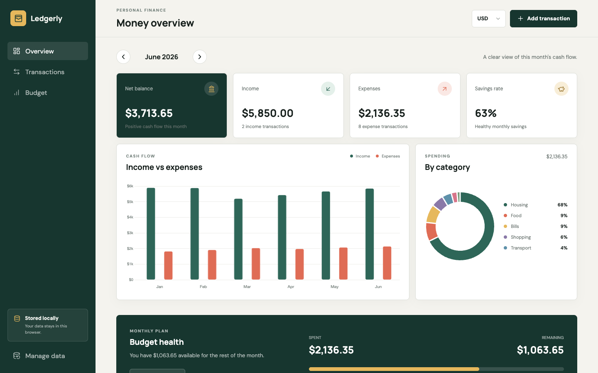

# Ledgerly Budget Tracker

Ledgerly is an advanced local-first budget tracker built with HTML, CSS, and vanilla JavaScript. Transactions, preferences, and budgets persist in browser Local Storage, so the app works on GitHub Pages without a backend.



## Live demo

[Open Ledgerly](https://kaunghtetkyaw511.github.io/ledgerly-budget-tracker/)

## Features

- Income and expense transaction CRUD
- Browser Local Storage persistence
- Monthly, daily, all-time, type, category, and search filters
- Six-month cash flow and category charts with Chart.js
- Monthly and category budget progress
- Multiple currency display options
- CSV export and JSON backup import/export
- Responsive desktop and mobile layouts
- Empty, confirmation, loading, and toast states

## Run locally

```bash
python3 -m http.server 4215
```

Then open `http://localhost:4215`.

## Library

- [Chart.js](https://www.chartjs.org/)
